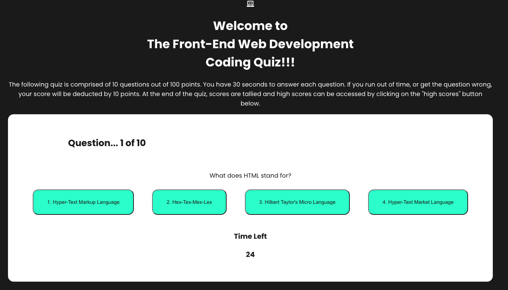

# Code Quiz

## Description
The following application is a 10 question quiz out of 100 points for beginners who are looking to test their knowledge of front-end web development. Each user has 30 seconds to complete an answer. For every wrong answer, 5 seconds will be deducted from the time for each question. If the timer runs out or a user completes the quiz, the quiz will end. When the quiz ends, a user can see their current high score and previous high scores pulled from local storage if they have taken the quiz before.

## Functionality
* 10 Question Quiz
* Questions iterate through an array of questions and answers
* Point totals are calcuated to sum a score
* Score are saved to local storage

## Languages
* HTML
* CSS
* Responsive Design
* Javascript

## Deployed Site
https://joshacross.github.io/code-quiz

## Reference Images
